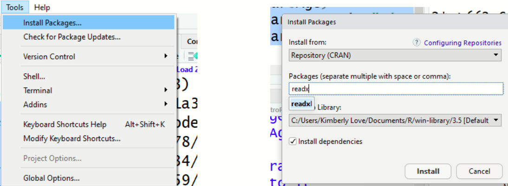
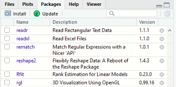

# Introduction to R part one

# <span style="color:pink"> Outlines</span>

1. What / Why R? 

2. Rstudio & R

   a. The Source, Console, Help and Environment panes

   b. Functions and Data Objects

3. Working with R: Objects and Workspace

   a. R Objects & Project Management

   b. Good Coding practice
   
---

#  What is R?

* Computer language & environment for statistical computing & graphics. 

* Script based (text computer code), not GUI based (menu / point & click).

* Tools for Data Handling and manipulation

* Large collection of statistical tools (packages) for Data Analysis;
 
   + .red[contributed by many experts]

* Graphical interface for Visualizing Data & results from statistical analyses


* Relatively simple and effective, widely used, 
   + **free, open source**.

---

#  Why R?

-	Open source (free!): 

   + open for anyone to review and contribute.

-	Maintained by top quality experts

-	Built for statistical analysis 

-	Reproducible and transparent:

   + Saved R code can be used to easily reproduce any analysis and Collaborators can share their work in the R script format.

-	<span style="color:blueviolet">Publication-ready data visualization</span> 

-	Software compatibility


-	<span style="color:blueviolet">Generating reports in various formats (MS word, PDF)</span>

---

# <span style="color:pink">2. RStudio</span>

### What is RStudio? Why use it?

-	Best Integrated Development Environment (IDE) for R.

- <span style="color:darkred">Powerful and makes using R easier</span>

- RStudio can:

  - <span style="color:blue">Organize your code, output, and plots.</span>

  - <span style="color:blue">Auto-complete code and highlight syntax.</span>

  - <span style="color:blue">Help view data and objects.</span>

  - <span style="color:blue">Enable easy integration of R code into documents.</span>

-	<span style="color:darkred">User-friendly interfaces.</span>

---

# <span style="color:pink">Basic Setup</span>

### Installing R

- Visit <https://cran.r-project.org/>

- Or simply google [download R](https://cran.r-project.org/bin/windows/base/) to find the link to download page.

- Also, check out **Install R** tutorial video by RStudio, Inc.

### Installing RStudio

- Visit <https://www.rstudio.com/products/rstudio/download/>

- Or simply google [download Rstudio](https://www.rstudio.com/products/rstudio/download/) to find the link to download page.

-	Also, check out **Install RStudio** tutorial video by RStudio, Inc.

Choose the version for your computer and follow installation instructions. 

---

# <span style="color:pink">RStudio Overview</span>


---

# <span style="color:pink">Getting Started</span>

- RStudio will open with 4 sections (called panes): 

**<span style="color:cyan">1. Source editor pane</span>**
- Write and edit R scripts

**<span style="color:cyan">2. Console pane</span>**
- Interactively run R commands

**<span style="color:cyan">3. Environment/history pane</span>**
- <span style="color:orange">Environment:</span> view objects in the global environment
- <span style="color:orange">History:</span> search and view command history

**<span style="color:cyan">4. Files/Plots/Packages/Help pane </span>**
- <span style="color:orange">Files:</span> navigate directories
- <span style="color:orange">Plots:</span> view generated plots
- <span style="color:orange">Packages:</span> manage installed packages in the library
- <span style="color:orange">Help:</span> view help documentations for any package/function

---

# <span style="color:pink">Customization</span>

### Panes

- The size and position of panes can be customized. 

- On the top right of each pane, there are buttons to adjust the pane size. 

- Also, place your mouse pointer/cursor on the border line between panes and when the pointer changes its shape, click and drag to adjust the pane size. 

- For more options, go to **<span style="color:green">View > Panes</span>** on the menu bar. 

- Alternatively, try **<span style="color:green">Tools > Global Options > Pane Layout</span>**.

### Appearances

- The overall appearance can be customized as well. 

- Go to **<span style="color:green">Tools > Global options > Appearnce</span>** on the menu bar to change themes, fonts, and more.

---

# <span style="color:pink">Installing and Loading Packages</span>

- Packages are collections of R functions, data, and compiled code in a well-defined format. 
- There are three categories of packages. 

**<span style="color:blue">1. Base Packages:</span>** Providing the basic functionality, maintained by the R Core Development group. Currently, there are 14 packages, these are 
```{r}
rownames(installed.packages(priority="base"))
```

**<span style="color:blue">2. Recommended Packages:</span>** also a default package, mainly include additional more complex statistical procedures. These are 15 packages
```{r}
rownames(installed.packages(priority="recommended"))
```
---

**<span style="color:blue">3. Contributed packages:</span>** Due to the open nature of R, anyone can contribute new packages at any time. 

- Currently, the CRAN package repository features <span style="color:red">19022 available packages</span>.


### Installing Packages

- **Option 1:** <span style="color:orange">Menu</span>

```{r, fig.align='center', echo=F, out.width='75%'}

```

---

- **Option 2:** <span style="color:orange">Packages Window</span>
```{r, fig.align='center', echo=F, out.width='40%'}

```

- **Option 3:** <span style="color:orange">Code</span>

```{r, eval=FALSE}
install.packages("readxl") 
```

### Loading Packages

```{r, eval=FALSE}
library()   # see all packages installed
search()    # see packages currently loaded
```

---

# <span style="color:pink">Updating R and RStudio</span>

### Updating R

- Go to CRAN and download new version

- **More efficient:** install `installr` package, load it, and run `updateR()`

  - Updates R and Optionally updates all packages
  - **<span style="color:darkviolet">May be better to do this in `basic Rgui`</span>**
- Version should update automatically in RStudio

  - Check/change R version under **<span style="color:green">Tools>Global Options>R version</span>**

- Then update the R packages with the code:

```{r, eval=FALSE}
update.packages(ask = FALSE, checkBuilt = TRUE)
```

- To updating RStudio: Go to RStudio and download new version

- Click on <span style="color:green">Help>Check for Updates</span>, follow menu prompts

---

# <span style="color:pink">Functions and Help</span>

- Information about a function `read.table` can be accessed by typing the following into the console:

```{r, message=FALSE, warning=FALSE, eval=FALSE}

 help(read.table) # help about function read.table
 ?read.table # same thing
 help.start() # general help
 example("read.table") # show an example of function read.table
 Sys.Date()
```

- Arguments are the inputs to a function. 

- In this case, the only argument to `help()` is `read.table`. 

- Help files provide documentation on how to use functions and what functions produce.

---

# <span style="color:pink">3. Working with R Objects </span>

**Organize with an RStudio project**

* It is a good habit to immediately create a project for handling the analysis of new data and keep everything together. 
 
- The workspace is a working environment where R will store and remember user-defined objects: **vectors, matrices, data frames, lists, variables** etc. 

- To Create an R project, go to

- **File > New Project and then choose: New Directory> Name for the directory > Click on Create Project**

- For more complex project it may be useful to create sub-directories to contain
data, scripts and other documents separately. 

- Can also type the below function into the Console, but we won't do that in this session.

```{}
prodigenr::setup_project("C:/Users/yebel/Desktop/LearningR")
```

---

# <span style="color:pink">Creating R objects</span>

- Objects can be created in the form of
   - `variable <- value`  or `variable = value` or `variable -> value`.
   - Variable names can be letters, numbers, and the dot or underline characters but not dot followed by numbers `.4you `is illegal).
   
- the symbol `<-` (`Alt + -`) that could be read as `assign` or `place into` or `read in` etc. 

```{r}
# need to placed in quotes as diabetic is string.
A <-"Diabetic"#<< 
```

- The standard data objects in R are: **scalars, vectors, factors, matrices and arrays, lists, and data frames**.

- Data types assigned to each objects are: **logical, numeric, integer, character, complex.**

---

# <span style="color:pink">Vector</span>

- A set of scalars arranged in a one-dimensional array.

- Data values are all the same mode(data type), but can hold any mode.
   - e.g:(-2, 3.4, 3), (TRUE, FALSE, TRUE), ("blue", "gray", "red")
   
- Vectors can be created using the following functions:

- `c()` function to combine individual values
   - `x <- c(10.4, 5.6, 3.1, 6.4, 21.7)`

- `seq()` to create more complex sequences
   - `seq(from=1, to=10, by=2) or seq(1,10 )` 

- `rep()` to create replicates of values
   - `rep(1:4, times=2, each=2)`
   
---

# <span style="color:pink">Some useful functions in vector</span>

- `class(x):` returns class/type of vector x

- `length(x):` returns the total number of elements

- `x[length(x)]:` returns last value of vector x 

- `rev(x):` returns reversed vector

- `sort(x):` returns sorted vector

- `unique(x):` returns vector without multiple elements

- `range(x):` Range of x

- `quantile(x):` Quantiles of x for the given probabilities

- `which.max(x):`  index of maximum

- `which.min(x):`  index of minimum

---

# <span style="color:pink">Factors</span>

- A factor is used to store predefined categorical data

- Can be ordered and unordered
  - e.g. :("yes", "no", "no", "yes", "yes"), ("male", "female", "female", "male")

- Factors can be created using `factor()`

```{r}
size <- factor(c("small", "large", "small", "medium"))
```

- The levels of a factor can be displayed using `levels()`.

---

# <span style="color:pink">Matrix</span>

- Matrix is a rectangular array arranged in rows and columns. 

- The individual items in a matrix are called its elements or entries. 

- Matrices can be created by:

1. `matrix()`

2. converting a vector into a matrix

3. binding together vectors

- Matrices can be created using the functions:
   - `matrix()` creates a matrix by specifying rows and columns
   - `dim()` sets dimensions to a vector
   - `cbind` combines columns
   - `rbind` combines rows 

---

 e.g.
```{r}
m1<-matrix(data = 1:6, nrow = 3, ncol = 2)
m2<-cbind(1:3,5:7,10:12)
x=1:6
dim(x) <- c(2, 3)
```

- Note: `dim()` can also be used to retrieve dimensions of an object! 

**Assign names to rows and columns of a matrix**

```{r}
rownames(m1) <- c("A", "B", "C") 
colnames(m1)<- c("a","b")
```

---

# <span style="color:pink">Data frames</span>

- a data set in R is stored a data frame.

- Two-dimensional, arranged in rows and columns created using the function:  `data.frame()`
- e.g.
```{r, eval=FALSE, message=FALSE}
df <- data.frame(ID = 1:3, Sex = c("F", "F", "M"), Age = c(17, 18,18))
```

- We can enter data directly by access the editor using either the `edit()` or `fix()`

```{r, eval=FALSE}
 new.data<-data.frame()  # creates an "empty" data frame
 new.data<-edit(new.data) # request the changes or  `fix(new.data)`

```

- We'll use the data set called **diabetes data** to do this exploration. 

```{r, eval=FALSE}
library(readr)
diabetes <- read_csv("diabetes.csv")
#View(diabetes)
```
---

# <span style="color:pink">Quick intro to functions</span>


- Use `head()` and `tail()` to view the **first (and last) five rows**

- Use `View()` to **view an entire** `data.table` object

- Use `str()` to view the **structure** of `data.table` object

- Use `tables()` to **show all loaded `data.table` objects**

- **Sorting** and **ordering** rows using `setorder()` and `order()`

- Arguments are always enclosed in parentheses

- `colnames()` to look variable names

- `colSums(is.na())` to sum missing data

- Use `subset()` to subset data.

- Functions in R take named arguments.  

---

# <span style="color:pink">Subsetting</span>

```{r, eval=FALSE}
diabetes[] # the whole data frame 
diabetes[1, 1] # 1st element in 1st column 
diabetes[1, 6] # 1st element in the 6th column 
diabetes[, 1] # first column in the data frame 
diabetes[1] # first column in the data frame 
diabetes[1:3, 3] 
diabetes[3, ] # the 3rd row 
diabetes[1:6, ] # the 1st to 6th rows
diabetes[c(1,4), ] # rows 1 and 4 only 
diabetes[c(1,4), c(1,3) ] 
diabetes[, -1] # the whole except first column
```

