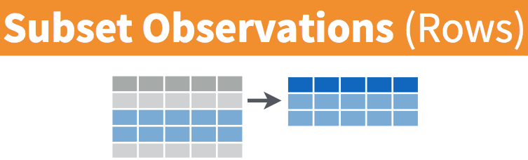

## Introduction to R-Part 2
**Outlines**

1. What is Tidyverse?

2. Data Manipulation using `dplyr()` package

3. Data Manipulation with `data.table()` package
   
---

# Data Manipulation


---
# What is Tidyverse?

- Tidyverse is a collection of friendly and consistent tools for data analysis
and visualization.

- a suite of packages that implement tidy methods for data importing,
cleaning, and wrangling. 

- Contains series of packages useful for data analysis which work together well.


```{r, eval=FALSE}
tidyverse_packages() #<<
```

- Then to work functions under tidyverse package we must always load the package into workplace.

```{r, eval=FALSE}
library(tidyverse) #<<
```

- Some packages under tidyverse are considered `core packages` and others called `friend packages`.

---

# install.packages("tidyverse")


**Core tidyverse**
- `tibble`, for tibbles, a modern re-imagining of data frames
- `readr`, for data import
- `tidyr`, for data tidying
- `ggplot2`, for data visualization
- `dplyr`, for data manipulation
- `stringr`, for strings
- `forcats`, for factors
- `purrr`, for functional programming

**Friends for data import (beyond readr)**
- `readxl`, for xls and xlsx files
- `haven`, for SPSS, SAS, and Stata files
- `jsonlite`, for JSON
- `xml2`, for XML
- `httr`, for web apis
- `rvest`, for web scraping
- `DBI`, for databases

**Friends for data wrangling for date**
- `lubridate`, for date/times
- `hms`, for times
- `blob`, for storing binary data

**Friends for modeling**
- `modelr`, for simple modelling within a pipeline 
- `broom`, for turning models into tidy data
---

# readr()

| Function|Function Reads|
|:--|:--|
|read_csv()|Comma separated values|
|read_csv2()|Semi-colon separate values|
|read_delim()|General delimited files|
|read_fwf()|Fixed width files|
|read_log()|Apache log files|
|read_table()|Space separated files|
|read_tsv()| Tab delimited values|

**Tibbles**

- `data.frames` are the basic form of rectangular data in R (columns of variables, rows of observations)
- `read_csv()` reads the data into a tibble, a modern version of the data frame.
- a tibble is a data frame

---

# haven()

- `read_sas()`: SAS

- `read_spss()`: SPSS

- `read_sav()`: SPSS

- `read_por()`: SPSS

- `read_stata()`: Stata

- `read_dta()`: Stata

- `haven` is not a core member of the tidyverse, so you need to load it.

```{r, eval=FALSE}
library(haven)
diabetes <- read_sas("diabetes.sas7bdat")
```

---

# Writing data

- Function with Writes

- `write_csv()`: Comma separated values

- `write_excel_csv()`:  CSV that you plan to open in Excel

- `write_delim()`: General delimited files

- `write_sas()`: SAS .sas7bdat files

- `write_sav()`: SPSS .sav files

- `write_stata()`: Stata .dta files

```{r, eval=FALSE}
write_csv(diabetes, path = "diabetes-clean.csv")
```

---
# dplyr() Package

- The **`dplyr`** provides a "grammar" (the verbs) for data manipulation and for operating on data frames in a tidy way. 
  

- The key operator and the essential verbs are:
  
1.  %>%: the "pipe" operator used to connect multiple verb actions together into a pipeline.

1. select(): return a subset of the columns of a data frame.

1. mutate(): add new variables/columns or transform existing variables.

1. filter(): extract a subset of rows from a data frame based on logical conditions.

1. arrange(): reorder rows of a data frame according to single or multiple variables.

1. summarise() / summarize(): reduce each group to a single row by calculating aggregate measures.

- We can have a look at the data and its structure by using the `glimpse()` function from the `dplyr` package.

---
# dplyr()

```{r, warnings=FALSE, message=FALSE, eval=FALSE}
library(dplyr)
library(gapminder)
glimpse(gapminder) 
```

Now we have the `dplyr` package uploaded, let us learn its verbs.

### The pipeline operater: **`%>%`** *read as* **and then**
  
- Works as **Left Hand Side (LHS)** `%>%`   **Right Hand Side (RHS)**
  
  - **x %>% f(..., y) ** **<==>** **f(x,y)**
  
- The "pipe" **passes the result of the *LHS as the 1st operator argument of the function on the RHS**.

  - **<span style="color:cyan">3 %>% sum(4)</span>**  **<==>** **<span style="color:blue">sum(3, 4)</span>**
  
- <span style="color:red">`%>%`</span> is very practical for chaining together multiple <span style="color:red">`dplyr`</span> functions in a sequence of operations.

---

# select()

- **<span style="color:red">select()</span>** uses for **pick variables by their names**


.png)

- <span style="color:red">`starts_with("X")`</span> every name that starts with "X".

- <span style="color:red">`ends_with("X")`</span> every name that ends with "X".

- <span style="color:red">`contains("X")`</span> every name that contains "X".

- <span style="color:red">`matches("X")`</span> every name that matches "X", where "X" can be a regular expression.

- <span style="color:red">`num_range("x", 1:5)`</span>  the variables named x01, x02, x03, x04, x05.

- <span style="color:red">`one_of(x)`</span> => every name that appears in x, which should be a character vector.

---
  
# <span style="color:red">Practice: Select your variables</span> 

1) that ends with letter `p`

2) starts with letter `co`. 

**Try to do this selection using base R.**  

Solutions:
  
```{r, echo = TRUE, eval=FALSE}
gm_pop_gdp <- select(gapminder, ends_with("p"))#<<
head(gm_pop_gdp, n = 1)
gm_cc <- select(gapminder, starts_with("co"))#<<
head(gm_cc, n = 1)
```

of course all of this could be done using **base R** for example:
  
```{r, echo = TRUE, eval=FALSE}
gm_cc <- gapminder[c("country", "continent")]
```

but it's less intuitive and often requires more typing. 

---

# <span style="color:pink">mutate()</span>

**Create new variables of existing variables:** <span style="color:red">`mutate()`</span>

.png)

- It will allow you to add to the data frame `df` a new column, `z`, which is the multiplication of the columns `x` and `y`: `mutate(df, z = x * y)`.

- If we would like to observe `lifeExp` measured in months we could create a new column `lifeExp_month`: 

```{r, echo = TRUE, eval=FALSE}
gapminder2 <- mutate(gapminder, LifeExp_month = lifeExp * 12) #<<
head(gapminder2, n = 2)
```

---

# <span style="color:pink">filter()</span>

**Pick observations by their values:** <span style="color:red">`filter()`</span>
```{r, out.width = "400px", echo=FALSE, fig.align='center'}

```
.png)

- There is a set of logical operators in **R** that you can use inside `filter()`:

- `x < y`: `TRUE` if `x` is less than `y`
- `x <= y`: `TRUE` if `x` is less than or equal to `y`
- `x == y`: `TRUE` if `x` equals `y`
- `x != y`: `TRUE` if `x` does not equal `y`
- `x >= y`: `TRUE` if `x` is greater than or equal to `y`
- `x > y`: `TRUE` if `x` is greater than `y`
- `x %in% c(a, b, c)`: `TRUE` if `x` is in the vector `c(a, b, c)`
- `is.na(x)`:  Is `NA`
- `!is.na(x)`: Is not `NA`

---

# <span style="color:red">Practice: Filter your data</span>

- Use `gapminder2` `df` to filter:

1) only European countries and save it as `gapmEU`

2) only European countries from 2000 onward and save it as `gapmEU21c`

3) rows where the life expectancy is greater than 80

Don't forget to **use `==` instead of `=`**! and
Don't forget the quotes **`" "`**

**Solutions:**

```{r, echo = TRUE, eval=FALSE}
gapmEU <- filter(gapminder2, continent == "Europe") #<<
head(gapmEU, 2)
```

```{r, echo = TRUE, eval=FALSE}
gapmEU21c <- filter(gapminder2, continent == "Europe" & year >= 2000)#<<
head(gapmEU21c, 2)
```

```{r, echo = TRUE, eval = FALSE}
filter(gapminder2, lifeExp > 80)#<<
```

---
# <span style="color:pink"> arrange() </span>

- **Reorder the rows.** 

- `arrange()` is used to reorder rows of a **d**ata **f**rame (df) according to one of the variables/columns.

.png)

- If you pass `arrange()` a character variable, **R** will rearrange the rows in alphabetical order according to values of the variable. 

- If you pass a factor variable, **R** will rearrange the rows according to the order of the levels in your factor (running `levels()` on the variable reveals this order).

---

# <span style="color:red">Practice: Arranging your data</span>

1) Arrange countries in `gapmEU21c` `df` by life expectancy in ascending and descending order.

2) Using `gapminder df`
  - Find the records with the smallest population
  
  - Find the records with the largest life expectancy.

 Solution 1):
```{r, echo = TRUE, eval=FALSE}
gapmEU21c_h2l <- arrange(gapmEU21c, lifeExp)#<<
head(gapmEU21c_h2l, 2)
gapmEU21c_l2h <- arrange(gapmEU21c, desc(lifeExp)) # note the use of desc()#<<
head(gapmEU21c_l2h, 2)
```

  Solution 2):
```{r, echo = TRUE, eval=FALSE}
arrange(gapminder, pop)#<<
```

---

# <span style="color:pink">summarise()</span>

```{r, echo = TRUE, eval=FALSE}
arrange(gapminder, desc(lifeExp))
```

**Collapse many values down to a single summary:** <span style="color:red">`summarise()`</span>

.png)

- The syntax of summarise() is simple and consistent with the other verbs included in the `dplyr` package.

- uses the same syntax as `mutate()`, but the resulting dataset consists of a single row instead of an entire new column in the case of `mutate()`. 

---

- builds a new dataset that contains only the summarising statistics.

| Objective | Function                | Description                    |
| --------- | ----------------------- | ------------------------------ |
| basic     | `sum(x)`                | Sum of vector x                |
| centre    | `mean(x)`               | Mean (average) of vector x     |
|           | `median(x)`             | Median of vector x             | 
| spread    | `sd(x)`                 | Standard deviation of vector x |
|           | `quantile(x, probs)`    | Quantile of vector x           |
|           | `range(x)`              | Range of vector x              |
|           | `diff(range(x)))`       | Width of the range of vector x |
|           | `min(x)`                | Min of vector x                |
|           | `max(x)`                | Max of vector x                |
|           | `abs(x)`                | Absolute value of a number x   | 

---

# <span style="color:red">Practice: Use `summarise()`:</span>

1) to print out a summary of gapminder containing two variables: max_lifeExp and max_gdpPercap.

2) to print out a summary of gapminder containing two variables: mean_lifeExp and mean_gdpPercap.

 Solution: Summarise your data

```{r, echo = TRUE, eval=FALSE}
summarise(gapminder, max_lifeExp = max(lifeExp), max_gdpPercap = max(gdpPercap))
```

```{r, echo = TRUE, eval=FALSE}
summarise(gapminder, mean_lifeExp = mean(lifeExp), mean_gdpPercap = mean(gdpPercap))
```

---

# <span style="color:pink">group_by()</span>

- **Subsetting:** <span style="color:red">`group_by()`</span>

- dplyr's `group_by()` function enables you to group your data. 

- It allows you to create a separate df that splits the original df by a variable.

- The function `summarise()` can be combined with `group_by()`.

.small[
| Objective | Function                | Description                               |
| --------- | ----------------------- | ----------------------------------------- |
| Position	| first()	                | First observation of the group            |
|           | last()	                | Last observation of the group             |
|           | nth()	                  | n-th observation of the group             |
| Count	    | n()	                    | Count the number of rows                  |
|           | n_distinct()	          | Count the number of distinct observations |
]
  
  
---
  
# <span style="color:pink">Practice: Subset your data</span>

1) Identify how many countries are given in gapminder data for each continent.

 Solution: 
  
```{r, echo = TRUE, eval = FALSE}
gapminder %>%
  group_by(continent) %>%
  summarise(n_distinct(country))
```

**Let's `%>%` all up!**

- You can try to get into the habit of using a shortcut for the pipe operator 

- What is relationship between population size (`pop`) and life expectancy (`lifeExp`)?

*Look what this code produces*

```{r, echo = TRUE, eval = FALSE, fig.height = 5, fig.width = 6, fig.align = 'center'}
gapminder_pipe <- gapminder %>%
  filter(continent == "Europe" & year ==  2007) %>%
  mutate(pop_e6 = pop / 1000000)
plot(gapminder_pipe$pop_e6, gapminder_pipe$lifeExp, cex = 0.5, col = "red")
```

---

# <span style="color:pink">tidyr</span>

- The `tidyr` can help you to create **tidy data**. Tidy data is data where:

- Every **column** is a **variable**
- Every **row** is an **observation**
- Every **cell** is a **single value**


The `tidyr` package embraces the **principles of tidy data** and provides the standard key functionalities to organise data values within a dataset.


---

# <span style="color:pink">Reshaping data using tidyr package</span>

- To make *wide format* data into *tall format* we have to turn columns into rows using `gather()` function.


.png)

- The tidyr package, provides four functions to change the layout of data set:

- `gather()`: gather (collapse) columns into rows
- `spread()`: spread rows into columns
- `separate()`: separate one column into multiple
- `unite()`: unite multiple columns into one

```{r, eval=FALSE}
library("tidyr") # loading `tidyr` package 
```

---

# <span style="color:pink">gather()</span>

- The function **gather()** collapses multiple columns into key-value pairs and produces long data format from wide data. 

```{r, eval=FALSE}
gather(data, key, value, ...) #<<
```

- `data`: A data frame
- `key, value`: Names of key and value columns to create in output
- `...`: Specification of columns to gather. Allowed values are:
     - variable names
     - if you want to select all variables between a and e, use a:e
     - if you want to exclude a column name y use -y
     
```{r, eval=FALSE}
HIV<-read.csv("HIV.csv")
```

```{r, eval=FALSE}
library(kableExtra)
HivdataLong<- HIV %>% gather(key=Time, value=Cd4,
-c(Id,BF,Sex)) %>% arrange(Id) 
```

---

# <span style="color:pink">spread()</span>

- spread two columns into multiple columns
- The function **spread()** does the reverse of **gather()**. 
- It takes two columns (key and value) and spreads into multiple columns. 

```{r,eval=FALSE}
spread(data, key, value)
```
- `data`: A data frame
- `key`: Name of the column whose values will be used as column headings.
- `value`: Names of the column whose values will populate the cells.
- Spread `Hivdata` to turn back to the original data

```{r, eval=FALSE}
 Widedata <- HivdataLong %>% 
  spread(Time, Cd4) %>%
  arrange(Id) 
```

---
# <span style="color:pink">unite()</span>

- Unite multiple columns into one

- The function unite() takes multiple columns and paste them together into one.

```{r, eval=FALSE}
unite(data, col, ..., sep = "_")
```

- `data`: A data frame
- `col`: The new (unquoted) name of column to add.
- `sep`: Separator to use between values
- The R code below uses the data set "HivdataLong" and unites the columns Breast feed and Sex.

```{r, eval=FALSE}
unite <- unite(HivdataLong, col = "BF_Sex",
                  BF, Sex,  sep = "_") #<<
```

---
# <span style="color:pink">separate()</span>

- separate one column into multiple
- The function **sperate()** is the reverse of **unite()**. 

```{r, eval=FALSE}
separate(data, col, into, sep = " ")
```

- **data**: A data frame
- **col**: Unquoted column names
- **into**: Character vector specifying the names of new variables to be created.
- **sep**: Separator between columns
- Separate the column `BF_Sex` [in unite] into two columns BF and Sex

```{r, eval=FALSE}
separate(unite, col = "BF_Sex",
         into = c("Breast Feed", "Sex"), sep = "_")
```

---

# <span style="color:pink">Reshaping Data pivot function</span>

We can also use the **pivot_()** function

- The **pivot_longer()** function reshapes data from wide format to long format
- The **pivot_wider()** function reshapes data from long format to wide format

```{r, eval=FALSE}
long <-  HIV %>%  pivot_longer(cols = -c(Id,BF,Sex),  
                 names_to = 'Time', values_to= 'Cd4')
 head(long)
```

Now, go backwards, and recreate the wide data!

```{r, eval= FALSE}
wide <- long%>%pivot_wider(names_from=Time,values_from=Cd4)
head(wide)
```

---

# <span style="color:pink"> Data Manipulation with data.table</span>

- `data.table()` is used for :

  - **Selecting rows**: `DT[i,j, by]`

  - Selecting rows using **helper functions**: `%like%` and `%between%`

  - Selecting columns: `DT[i, j, by]`

  - **Renaming** columns

  - Making **new columns while preserving the existing ones using** `:=`

  - **Summarising rows**: `DT[i, j, by]`

  - To **combine information**:

  - **Joining two `data.table` objects** using `merge()` and `data.table` syntax

   - **Full join**; **Inner join**; **Left join**; **Right join**

---

# <span style="color:pink">Structure of a data.table object</span>

```{r install_package, eval=FALSE}
install.packages("data.table")
library(data.table) # Extension of `data.frame`, CRAN v1.14.2
```

- Let's create `data.table` objects using `as.data.table()` and `data.table()`:

```{r create_datatable, eval=FALSE}
# to convert a dataframe obj to a data.table obj
(diabetesDT <- as.data.table(diabetes)) 
```

```{r create_datatable_1, eval=FALSE}
#create a DT from scratch
(exampleDT <- data.table(x = c(1,2), y = 4, z = c("banana", "mango")))
```

- Using `head()` and `tail()` functions, we view the first 3 rows of the data.table object:

```{r head_DT, eval=FALSE}
head(diabetesDT, n = 3)
```
- To show all `data.table`s loaded:

```{r show_loaded_datatables, eval=FALSE}
tables()
```

---

# <span style="color:pink">Sorting and ordering rows</span>

- We will use the functions `setorder(data.table, ...)` and `order` to sort rows.
  - `-:` to sort a variable in descending order.

```{r ordering_rows-setorder, eval=FALSE}
#ordering ascending - default
setorder(diabetesDT, frame)
```
- Also, we can sort based on multiple columns:

```{r multiple_ordering_rows-setorder, eval=FALSE}
#sorting based on multiple cols
setorder(diabetesDT, id, chol, location)
```

```{r multiple_ordering_rows-order, eval=FALSE}
#sorting based on multiple cols
diabetesDT[order(id, -location)]
```

---

# <span style="color:pink">Selecting rows</span>

`DT[i,j, by]`, where `i`: on which rows?

```{r selecting_rows_eg(2), eval=FALSE}
diabetesDT[3:4, ] #selects the 3rd and 4th rows plus all the columns
diabetesDT[-(1:5)]; diabetesDT[!(1:5)]  #deselects rows 1 to 5
diabetesDT[1:(.N-5)] # select all rows except the last 5 rows
```

- We can also select rows based on a condition fulfilled in column(s):

```{r select_rows_based_condition, eval=FALSE}
diabetesDT[gender == "male"] # select male gender
```

- The **helper** functions can also be used to select rows:
  - `%like%` looks for a pattern in a character or a factor vector.
  
```{r select_rows_helper_fn_like, eval=FALSE}
diabetesDT[gender %like% "f"]# select rows a letter f in them
```

  - `%between%` looks for values in a closed interval [val1, val2].

```{r select_rows_helper_fn_between, eval=FALSE}
diabetesDT[id %between% c(1000, 1005)]# select id between 1000 and 1005
```

---

# <span style="color:pink">Selecting columns</span>

`DT[i, j, by]`

- `j`: what to do? -> select columns

```{r select_cols_eg(1), eval=FALSE}
# select gender col
diabetesDT[, gender]
```

Note: Character vector is returned.

```{r select_cols_eg(2), eval=FALSE}
diabetesDT[, "gender"]
```

- Let's deselect column `gender`:

```{r deselect_cols1, eval=FALSE}
# select all cols expect gender col
diabetesDT[, -c("gender")]
```

```{r deselect_cols2, eval=FALSE}
diabetesDT[, !c("gender")]# all cols except gender
```

---

- We can also select and rename columns at the same time: `DT[, list(new_name = old_name)]`.

```{r select_and_rename_cols1, eval=FALSE}
# selects col and rename
diabetesDT[, list(gender, sex = gender)]
```
    
  - Instead of `list()`, we can also use `.()`. Example:

```{r select_and_rename_cols2, eval=FALSE}
# selects col and rename
diabetesDT[, .(gender, sex = gender)]
```
  
- We can do the above simultaneously. For example,

```{r multiple_Selecting_rows_cols, eval=FALSE}
# select rows based on a condition, and deselect island col
diabetesDT[gender == "female" & age < 50 &
             weight > 180, !c("waist")]
```

---

# <span style="color:pink">Making new columns </span>

`DT[i, j, by]`

- `j`: what to do? -> computing new columns while preserving existing ones.
- The operator `:=` adds/updates/deletes columns following the `by` reference.
Option 1:

```{r new_cols_preserving_old_op1, eval=FALSE}
diabetesDT[, BMI := weight/height*height][, newage := age-5]
```
Option 2: **LHS := RHS form**

```{r new_cols_preserving_old_op2, eval=FALSE}
diabetesDT[, c("BMI","newage") := list(weight/(height*height), age-5)]
```
Option 3: **Functional form**

```{r new_cols_preserving_old_op3, eval=FALSE}
diabetesDT[, `:=` (BMI = weight/(height*height),newage =   age-5)]
```

---

# <span style="color:pink">Summarising rows</span>

`DT[i,j, by]`

- `j`: what to do? -> summarise

```{r count_factor, eval=FALSE}
# count of species and islands; our sample size
diabetesDT[, .(nSamples = .N, 
               gendercat = uniqueN(gender),
               framecat = uniqueN(frame))]
```

---

# <span style="color:pink">Joining two data.tables </span>

- `DT[i, on]`
   - `i` -> join to which data.table?
   - `on` -> join key columns?

```{r join_two_DT_using_data.table_syntax, eval=FALSE}
(x <- data.table(id = c(1, 2, 4, 5, 6),x = c(45, 67, 90, 54, 8)))
(y <- data.table(id = c(1, 3, 4, 6, 6), y = c(8, 14, 19, 2, 4)))
```

- Let's join the two data.tables - inner join using base R `merge` function.

```{r inner_join_merge, eval=FALSE}
merge(x = x, y = y, by = "id")#inner join - merge
```

```{r full_join_merge, eval=FALSE}
merge(x = x, y = y, by = "id", all = TRUE)# full join - merge
```

```{r right_join_merge, eval=FALSE}
# right join - merge
merge(x = x, y = y, by = "id", all.y = TRUE)
```


