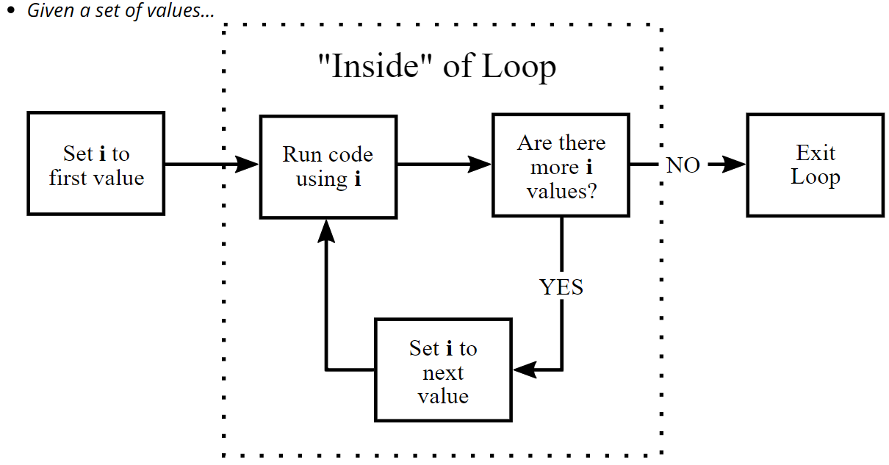

```{r setup, include=FALSE, purl=FALSE}
options(htmltools.dir.version = FALSE)
knitr::opts_chunk$set(comment = "##")
library(datasets)
library(ggplot2)
library(dplyr)
```

```{r xaringan-logo, echo=FALSE}
xaringanExtra::use_logo(image_url = "Rlogo.png",   width = "90px",height = "85px")
```

```{r xaringan-themer, include=FALSE}
library(xaringanthemer)
style_duo_accent(
  primary_color = "#008080", 
  secondary_color = "#0556AA",
  #text_font_google = google_font("Roboto"),
  text_font_size = "23px",
  background_color = "#FFFFFF",
  #code_font_family = "Ligature Code",
  code_font_size = "0.9em", 
  footnote_color = "blue",
  footnote_position_bottom = "0.1em",
)
```


## Control flow constructs

- Often when we're coding we want to control the flow of our actions. 
- Control flow is simply the order in which we code and have our statements evaluated.

1. __Conditional statements__:  things to happen only if a condition or a set of conditions are met

   - single condition, single response: `if()`,
   - multiple conditions, multiple responses: 
      - `if{} else{}` vs. `ifelse()`
      - extending `if{} else{}`
      - `case_when()`
   
2. .opacity20[__Repeating operations__: an action to be computed for a particular number of times.

   - perform operation *n* times: `for()`
   - perform operation unlimited times while condition holds: `while() / repeat()`
   - break out of loop or advance to next iteration: `break() / next()`   
]

---

### `if()`

.font140[We use .blue.bold[`if()`] to execute code when a .blue[single condition] holds.]

.pull-left[
1. evaluates if the test expression is `TRUE`

2. if `TRUE`, execute statement

3. if `FALSE`, do nothing

Say, for example, that we want R to print a message depending on the value of `x`

<br>

.center.font120[When .font130[`TRUE`]]
]
.pull-right[
.code130[
```r
if (test_expression) {
  statement
}
```
]

.code110[
```{r}
set.seed(10)
x <- runif(1)
if(x > .5) {
  paste("x equals", 
        round(x, 2), 
        "which is greater than 0.5")
}
```
]
]

---

### What do you expect to happen?

- What do you expect to happen with this example? `r anicon::cia("images/homer_thinking.png", animate = FALSE, size = 2)`
.code120[

```{r, results='hide', eval=FALSE}
x <- c(8, 3, -2, 5)

if(x < 0) {
  print("x contains a negative number")
}
```
]

--

.pull-left[
.font120[
`r anicon::faa("exclamation-triangle", colour = "red")``r anicon::faa("exclamation-triangle", colour = "red")` Common mistake `r anicon::faa("exclamation-triangle", colour = "red")``r anicon::faa("exclamation-triangle", colour = "red")`

* `if()` is .red[not vectorized]
* `if()` looks for a .red[single logical value]
* this code block evaluated the first element in `x` but not the rest
]
]

.pull-right[
.code120[
```{r, eval=FALSE}
if(x < 0) {
  print("x contains a negative number")
}
## Warning message:
## In if (x < 0) { :
##   the condition has length > 1 and only the first element will be used
```
]
]

---


## `if else`

.font110[We can extend an .blue.bold[`if()`] with .blue.bold[`else`] to return two responses based on a single condition.]

.pull-left[
1. evaluates if the test expression is `TRUE`

2. if `TRUE`, execute statement 1

3. if `FALSE`, exectute statement 2
]

.pull-right[
```r
# syntax of if statement
if (test_expression) {
  statement 1
} else {
  statement 2
}
```
]

- Now our earlier example will return one result when the test expression returns `TRUE` and another when it returns `FALSE`

```{r}
set.seed(10); x <- runif(1)
if(x > .7) {
  paste("x equals", round(x, 2),"which is greater than 0.7")
} else { #<<
  paste("x equals", round(x, 2),"which is less than 0.7") #<<
} #<<
```
---

## A right way to do things and a wrong way

- which statement is correct and which is not?  Why? 

.pull-left[

.center.font200[`r anicon::cia("https://emojis.slackmojis.com/emojis/images/1471987891/1069/thumbs_up.gif?1471987891", animate = FALSE)`]

```{r}
if(x > .5) {
  TRUE
} else { #<<
  FALSE
}
```
]

.pull-right[

.center.font200[`r anicon::cia("https://emojis.slackmojis.com/emojis/images/1471987891/1068/thumbs_down.gif?1471987891", animate = FALSE)`]

```{r, eval=FALSE}
if(x > .5) {
  TRUE
}  #<<
else { #<<
  FALSE
}
## Error: unexpected '}' in "}"
```
]

.center[`r anicon::faa("exclamation-triangle", colour = "red", speed = "slow")` Common mistake: `else` must start on the same line as the closing `}` of the prior `if` statement. `r anicon::faa("exclamation-triangle", colour = "red", speed = "slow")`]

---

# Considering multiple conditions

.font110[We can continue to expand an .blue[`if...else`] statement:]

.code130[
```{r}
if(x < 3) {
  print("x has low tolerance")
} else if(x == 3 & x < 8) {
  print("x has moderate tolerance")
} else {
  print("x has high tolerance")
}
```
]

.center.bold.font120[Note how we extend by following .font130[`else`] with .font130[`if()`].  But we should always end with an .font130[`else`].]

---

# Loop

- Often, we need to execute repetitive code statements a particular number of times. 

- Or, we may even need to execute code for an undetermined number of times until a certain condition no longer holds.

* `for` loops: execute code for a prescribed number of times (Rule of `r emo::ji("+1")`, 3x).

* `while` & `repeat` loops: repeat code while condition holds

* `next` & `break`: additional clauses to control flow

---

## The for() Loop

- `for()` loops are the most general kind of loop, found in pretty much every programming language.

- For each of these values—in order—do this

*Conceptually:*

- Given a set of values...

1. You set an index variable (often `i`) equal to the first value

1. Do some set of things (usually depending on current value)

1. Is there a next value?

   - `YES:` Update to next value, go back to 2.
   - `NO:` Exit loop
- We are looping through values and repeating some actions.

---

## for() Loop: Diagram
```{r, out.width = "85%", echo=FALSE, fig.align='center'}

```

---

- `for()` Loop: Example
```{r, eval=FALSE}
for(i in 1:10) {
    # inside for, output won't show up without print()
    print(i^2) 
}
```

- Note this runs 10 separate print commands, which is why each line starts with [1].

- These Do the Same Thing
.pull-left[
```{r}
for(i in 1:3) {
    print(i^2) 
}
```
]
.pull-right[
```{r, eval=FALSE}
i <- 1
print(i^2) 
i <- 2
print(i^2)
i <- 3
print(i^2)
```
]

---
# `for` loop: example

.pull-left[
* For each element in sequence (1-100) perform some defined task

* What will this .font120[`for`] loop do?

* .red[`i` takes on the value of the numbers in the sequence]
]

.pull-right[

```{r, eval=FALSE}
for(i in 1:100) {
  <do stuff here with i>
}
```

```{r}
for (i in 2010:2017) {
  print(paste("The year is", i))
}
```
]

---

### `for` loop: sequence input

.pull-left[
* Often, the length of the sequence is determined by some pre-defined variable

* For example, say we have a variable .font120.blue[`x`] and we want to iterate over each element and do something

* We can do this two ways

]

.pull-right[

```{r, eval=FALSE}
x <- 2010:2017 #<<
# option 1
for(i in 1:length(x)) {
  <do stuff here with x[i]>
}
# option 2
for(i in seq_along(x)) {
  <do stuff here with x[i]>
}
```

]

<br>
.center.bold.red[Talk to your neighbor. Do you prefer one over the other? `r anicon::cia("https://emojis.slackmojis.com/emojis/images/1504806416/2885/thinking-face-rotating.gif?1504806416", animate = FALSE, size = 2)`
]

---

### `for` loop: sequence input

.pull-left[
* Often, the length of the sequence is determined by some pre-defined variable

* For example, say we have a variable .font120.blue[`x`] and we want to iterate over each element and do something

* We can do this two ways

* But `seq_along(x)` is safer for edge cases where the sequence has length zero
]
.pull-right[
```{r}
x <- c()
# option 1: executes although
for(i in 1:length(x)) {
  print(i)
}
# option 2: does not execute
for(i in seq_along(x)) {
  print(i)
}
```
]

.center.bold.red[Beware iterating over `1:length(x)`. This will fail in unhelpful ways if `x` has length 0]

---

### `for` loop: generating output

.pull-left[

* Often we are generating output from the `for` loop that we want to use later

* We can do this by either .bold.red[growing] or .bold.green[filling] the output

* Pre-allocating the output and .bold.green[filling] in the results is more efficient

]

.pull-right[

.code70[
```{r}
# Let's create 100 different vectors 
means <- seq(0, 100, by = 1)
out <- list()
system.time({
  for(i in seq_along(means)) {
    gen_data<-rnorm(10000,means[[i]])
    out <- c(out, gen_data)
  }
})
out<- vector("list", length(means))
system.time({
  for(i in seq_along(means)) {
    out[[i]]<- rnorm(10000, means[[i]])
  }
})
```
]
]

---

### Controlling sequences

.pull-left[
- There are two ways to control the progression of a loop:
  
  * `next`: terminates the current iteration and advances to the next.
  
  * `break`: exits the entire `for` loop.
]

.pull-right[
```{r}
x <- c(1, 2, NA, 3)
for (i in x) {
  if (is.na(i)) next#if NA don't execute #<<
  print(i)
}
```

```{r}
for (i in x) {
  if (is.na(i)) break # if NA stop! #<<
  print(i)
}
```
]

.center.red[_both are used in conjunction with `if` statements_]

---

# Warning `r anicon::faa("exclamation-triangle", animate = FALSE, color = "red")`

Note that `break` and `next` only control the progression of the .red.bold[direct] loop environment they are in.

.pull-left[

.center[Break out of inner loop only]

```{r}
x <- 1:3
y <- c("a", "b", NA)
for(i in x) {
  print(i)
  for(j in y) {
    if(is.na(j)) break 
    print(j)
  }
}
```
]
.pull-right[

.center[Stop entire process.]

```{r, error=TRUE}
x <- 1:3
y <- c("a", "b", NA)
for(i in x) {
  print(i)
  for(j in y) {
    if(is.na(j)) stop
    print(j)
  }
}
```
]

---

### Repeating code for undefined number of iterations

- Sometimes we need to execute code for an undetermined number of times until a certain condition no longer holds.

- Two very similar options:

.pull-left[
.center.bold[while loop]

```{r, eval=FALSE}
while(condition) {
  <do stuff>
}
```

<div style="height:8px;font-size:8px;">&nbsp;</div>

* Test condition first
* Then execute code
]

.pull-right[

.center.bold[repeat loop]

```{r, eval=FALSE}
repeat {
  <do stuff>
    
  if(condition) break  
}
```

* Execute code first
* Then test condition
]

---

## Repeating code for undefined number of iterations

- The probability of flipping 10 coins and getting all heads or tails is $(\frac{1}{2})^{10} = 0.0009765625$ (1 in 1024 tries). How quickly can we achieve this accomplishment?

.pull-left[
.center[Using `while`]
```{r}
coin <- c("heads", "tails")
n_tries <- 0
flip <- NULL
while(length(unique(flip)) != 1) {
   flip<- sample(coin, 10,replace= TRUE)
    # add to the number of tries
  n_tries <- n_tries + 1
}
n_tries
```
]

.pull-right[
.center[Using `repeat`]
```{r}
coin <- c("heads", "tails")
n_tries <- 0
repeat {
  flip<- sample(coin, 10, replace=TRUE)
    # add to the number of tries
  n_tries <- n_tries + 1
#if current flip contains heads/tails
  if(length(unique(flip)) == 1) {
    print(n_tries)
    break
  }
}
```
]

---

### Stop the while loop: break

- There are some very rare situations in which severe speeding is necessary: what if a hurricane is approaching and you have to get away as quickly as possible? 


- This seems like a great opportunity to include the `break` statement in the `while` loop you've been working on. 

- Remember that the `break` statement is a control statement. 

- When R encounters it, the `while` loop is abandoned completely.

---

#### example

*Finish the* `while` *loop so that it:*

* *Prints out the triple of* `i`*, so* `3 * i`*, at each run.*
* *Loop is abandoned with a* `break` *if the triple of* `i` *is divisible by 8, but still prints out this triple before breaking.*

.pull-left[

```{r, eval=FALSE}
# Initialize i as 1 
i <- 1
while (i <= 10) {
  print(i * 3)
  if (i * 3 %% 8 == 0) {
    break
  }
  i <- i + 1
}
```
]
.pull-right[
```{r, echo=FALSE}
# Initialize i as 1 
i <- 1
while (i <= 10) {
  print(i * 3)
  if (i * 3 %% 8 == 0) {
    break
  }
  i <- i + 1
}
```


---

# Writing Functions

### Why Write Your Own Functions?

* A function centralizes a common task to a single, abstract method

* This helps to:

   - increase .green[reusability] 
  
   - reduces .red[verbosity]
  
   - reduces .red[repetitiveness]
  
   - reduces the .red[chance of making an error]
  
   - reduces .red[instances requiring updates] when changes are needed
  
   - reduces .red[amount of code to test]

---

## Consider the following.  Where's the .red[error]?

```{r, eval=FALSE}
df <- tibble::tibble(a = rnorm(10),  b = rnorm(10),
  c = rnorm(10),  d = rnorm(10))

df$a <- (df$a - min(df$a, na.rm = TRUE)) / 
  (max(df$a, na.rm = TRUE) - min(df$a, na.rm = TRUE))
df$b <- (df$b - min(df$b, na.rm = TRUE)) / 
  (max(df$b, na.rm = TRUE) - min(df$a, na.rm = TRUE)) #<<
df$c <- (df$c - min(df$c, na.rm = TRUE)) / 
  (max(df$c, na.rm = TRUE) - min(df$c, na.rm = TRUE))
df$d <- (df$d - min(df$d, na.rm = TRUE)) / 
  (max(df$d, na.rm = TRUE) - min(df$d, na.rm = TRUE))
```

---
# Key ingredients of a function

<br>
.pull-left[
.font140[
1. Name

2. arguments 

3. body 

4. environment
]
]

.pull-left[

<br>

```r
my_fun <- function(arg1, arg2) {
  << body >>
 }
```

]

---

### Defining a function

.pull-left[
.opacity20[
* We define a function with `<-` just like we define any other R object 

* Use informative names; strive to use verbs when possible 

* We can define a function with no arguments; however, this is rarely useful
]
.font120[
* Consequently, most functions have all key ingredients
]
]

.pull-right[

.opacity20[
```{r, eval=FALSE}
present_value <- function() {
  
}
```
]
.opacity20[
```{r, eval=FALSE}
compute_pv <- function() {
  
}
```
]
.opacity20[
```{r}
compute_pv <- function() {
  1000 / (1 + 0.05)^10
}
```
]
.code80[
```{r}
compute_pv <- function(fv, r, n) {
  fv / (1 + r)^n
}
compute_pv(fv = 1000, r = .05, n = 10)
compute_pv(fv = 2000, r = .08, n = 5)
```
]
]

---

## Calling arguments in different ways

.font120[Many ways to call arguments:]

.pull-left[
.font120[
* Using argument names

* Positional matching

* Must use names if you change order

* ...otherwise error or incorrect computation will occur

* missing arguments results in error
]
]

.pull-right[

```{r name-matching}
compute_pv(fv = 1000, r = .05, n = 10)
```

```{r positional-matching}
compute_pv(1000, .05, 10)
```

```{r reorder-with-names}
compute_pv(r = .05, fv = 1000, n = 10)
```

```{r reorder-without-names}
compute_pv(.05, 1000, 10)
```

```{r missing-args, error=TRUE}
compute_pv(1000, .05)
```
]

