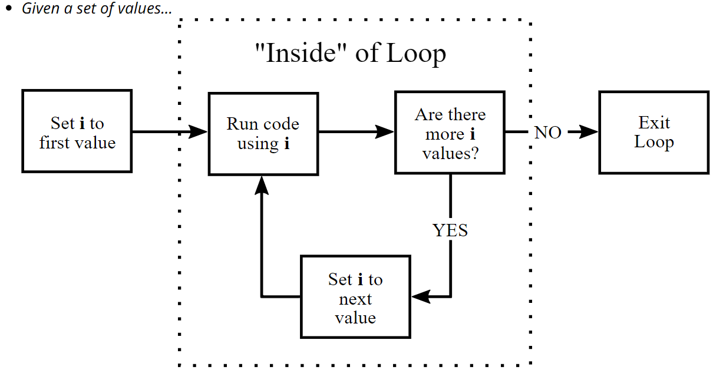

# Control Statements and Programming with functions


```{r xaringan-logo, echo=FALSE}
xaringanExtra::use_logo(image_url = "Rlogo.png",   width = "90px",height = "85px")
```
## Outlines

2.1. Conditional and Repetitive executions

2.1.1. if statements

2.1.2. for, while, and repeat loops

2.2. Function definition


## Bad Repetition

- If someone doesn't know better, they might find the means of variables in the swiss data by typing in a line of code for each column:

```{r, eval=FALSE, message=FALSE, warning=FALSE}
mean1 <- mean(swiss$Fertility)
mean2 <- mean(swiss$Agriculture)
mean3 <- mean(swissExamination)
mean4 <- mean(swiss$Fertility)
mean5 <- mean(swiss$Catholic)
mean5 <- mean(swiss$Infant.Mortality)
c(mean1, mean2 mean3, mean4, mean5, man6)#<<
```

**Can you spot the problems?**

How upset would they be if the swiss data had 200 columns instead of 6?


## Good Repetition

```{r}
swiss_means <- setNames(numeric(ncol(swiss)), colnames(swiss))
for(i in seq_along(swiss)) {
    swiss_means[i] <- mean(swiss[[i]])
}
swiss_means
```

- 'setNames()' adds `names` (second argument) to its first argument.
- `numeric()` creates a numeric vector of length equal to its first argument.

**What is the use Repetition**

- Writing code to repeat tasks for us reduces the most common human coding mistakes.

- It also substantially reduces the time and effort involved in processing large volumes of data.

- Lastly, compact code is more readable and easier to troubleshoot.


## Conditional Flow

**`if()` then `else`**

- You've seen `ifelse()` before for logical checks on a whole vector.

- For checking whether a single logical statement holds and then conditionally executing a set of actions, use `if()` and `else:`

```{r, eval=FALSE}
for(i in 1:10) {
  if(i %% 2 == 0) { # %% gets remainder after division
    print(paste0("The number ", i, " is even."))
  } else if(i %% 3 == 0) {
    print(paste0("The number ", i, " is divisible by 3."))
  } else {
    print(paste0("The number ", i, " is not divisible by 2 or 3."))
  }
}

```

- Warning! else needs to be on same line as the closing brace `}` of previous `if()`.


## The for() Loop

- `for()` loops are the most general kind of loop, found in pretty much every programming language.

- For each of these values—in order—do this

*Conceptually:*

- Given a set of values...

1. You set an index variable (often `i`) equal to the first value

1. Do some set of things (usually depending on current value)

1. Is there a next value?

   - `YES:` Update to next value, go back to 2.
   - `NO:` Exit loop

- We are looping through values and repeating some actions.


## for() Loop: Diagram




- `for()` Loop: Example
```{r, eval=FALSE}
for(i in 1:10) {
    # inside for, output won't show up without print()
    print(i^2) 
}
```

- Note this runs 10 separate print commands, which is why each line starts with [1].

- These Do the Same Thing
.pull-left[
```{r}
for(i in 1:3) {
    print(i^2) 
}
```
]
.pull-right[
```{r, eval=FALSE}
i <- 1
print(i^2) 
i <- 2
print(i^2)
i <- 3
print(i^2)
```
]


## Iteration Conventions

- We call what happens in the loop for a particular value one iteration.
- Iterating over indices `1:n` is very common.

- `n` might be the length of a vector, the number of rows or columns in a matrix or data frame, or the length of a list.
- **Common notation:** `i` is the object that holds the current value inside the loop.

- If loops are nested, you will often see `j` and `k` used for the inner loops.

- This notation is similar to indexing in mathematical symbols (e.g  $\sum_{i=1}^n)$

- Note `i` (and `j`,`k`, etc) are just normal objects. You can use any other names you want.


## Iterate Over Characters

- What we iterate over doesn't have to be numbers `1:n` or numbers at all! You can also iterate over a character vector in R:

```{r}
some_letters <- letters[4:6] # Vector of letters d,e,f
for(i in some_letters) {
    print(i)
}
i # in R, this will exist outside of the loop!

```


## `seq_along()` and Messages

- `seq_along(x)` creates an integer vector equal to `1:length(x)`.

- When you want to loop over something that isn't numeric but want to use a numeric index of where you are in the loop, `seq_along` is useful:

```{r}
for(a in seq_along(some_letters)) {
    print(paste0("Letter ", a, ": ", some_letters[a]))
}
a # The object a contains the number of the last iteration
```

---

## `while()` Loops

- A lesser-used looping structure is the `while()` loop.

- Rather than iterating over a predefined vector, the loop keeps going until some condition is no longer true.

- Let's see how many times we need to flip a coin to get `4` heads:

```{r}
num_heads <- 0
num_flips <- 0
while(num_heads < 4) {
  coin_flip <- rbinom(n = 1, size = 1, prob = 0.5)
  if (coin_flip == 1) { num_heads <- num_heads + 1 }
  num_flips <- num_flips + 1
}
num_flips # follows negative binomial distribution
```

---

# Writing Functions

### Why Write Your Own Functions?

- Functions can encapsulate actions you might perform often, such as:
 
  - Given a vector, compute some special summary stats

  - Given a vector and definition of `invalid` values, replace with NA

  - Templates for favorite ggplots used in reports

  - Defining a new logical operator

---

## Creating functions

- Creating functions in R is pretty simple: we assign a function to a variable, just like any other variable assignment:

```{r}
my_fn <- function(x) {
  2 * x
}
```

- a function is made up of arguments(the bit between the parentheses) and the body (the bit between the curly brackets).

- The last executed expression is returned from the function

```{r}
my_fn(3)
```

---

- arguments are like variables that we can specify when we *call* the function.

- a function can have 0 arguments, or many arguments

.pull-left[
```{r}
my_fn <- function() {
  3
}
my_fn()
```
]
.pull-right[
```{r}
my_fn <- function(x, y) {
  x + y
}
my_fn(3, 2)
```
]

- a function can be **variadic** by specifying a ... argument, this is somewhat outside of the scope for today, but allows you to create functions with a variable number of arguments. 

- Often in R this is used to provide arguments that are passed to other functions.

```{r}
function(x, y, ...) {
  other_function(...)
}
```

---

- The body of the function can be split over multiple lines of code. It's common to include flow-control statements within a function, e.g.

- `if` and `else` statements
- `for` and `while` loops
- `stop` statements (used to produce an **error** message)
- `return` statements (immediately exits the function returning a given value)

.pull-left[

```{r}
my_fn <- function(x) {
  if (x > 10) {
    stop ("x is too big!")
  } else if (x > 5) {
    return (x*2)
  }
  y <- x - 1
  for (i in 1:5) {
    y <- y*2
  }
  y
}
```
]
.pull-right[

```{r}
my_fn(2)
my_fn(5)
my_fn(6)
my_fn(10)
```
]

---

## function argument/variable scope

- the values that are used in the function only exist in the function: we can't use them outside of the function

```{r}
my_fn <- function(x) {
  y <- 2 * x
  c(exists("x"), exists("y"))
}
my_fn(3)

c(exists("x"), exists("y"))

```

---

- we can access variables that are defined outside of the function, but we can't modify them
```{r}
v <- 8
my_fn <- function(x) {
  y <- 2 * x
  v <- v - 1
  y + v
}
my_fn(3)
```


- Now, inside the function call we decreased the value of v, but if we look at what value v has now we will see it hasn't changed

```{r}
v
```

- R has created a new version of v inside the function and updated that value.

---


## default arguments

- you can specify default values for arguments: an argument with a default value does not have to be specified when you call the function

```{r}
my_fn <- function(x, y = 3) {
  x + y
}
my_fn(4)

```

- In this case we only passed a value for `x (4)`, y defaulted to *3*. But you can provide values, like so

```{r}
my_fn(4, 5)

```

---

## argument order

- by default, the arguments are evaluated in order (x, then y). 

- But, you can specify them in any order if you provide the name of the argument.

```{r}
my_fn(y = 5, x = 4)
my_fn(y = 5, 4)
```

---

## Using functions like variables

- because functions are just variables, you are able to pass functions as arguments to other functions

```{r}
f <- function(values, fn) {
  fn(values)
}
f(c(1, 2, 5, 8), mean)
f(c(1, 2, 5, 8), median)
```

- note, here the functions are passed without the parentheses:  we are passing the function, not the result of evaluating the function


