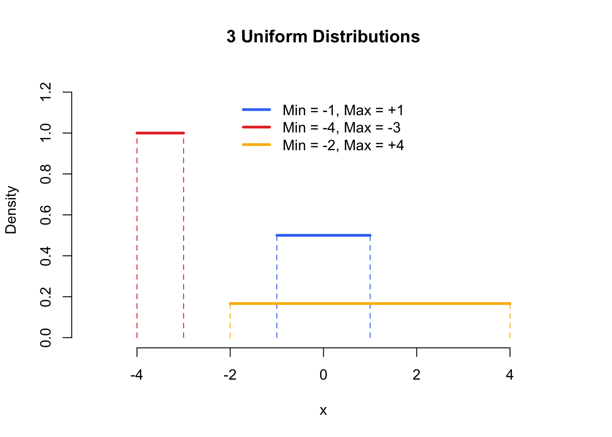
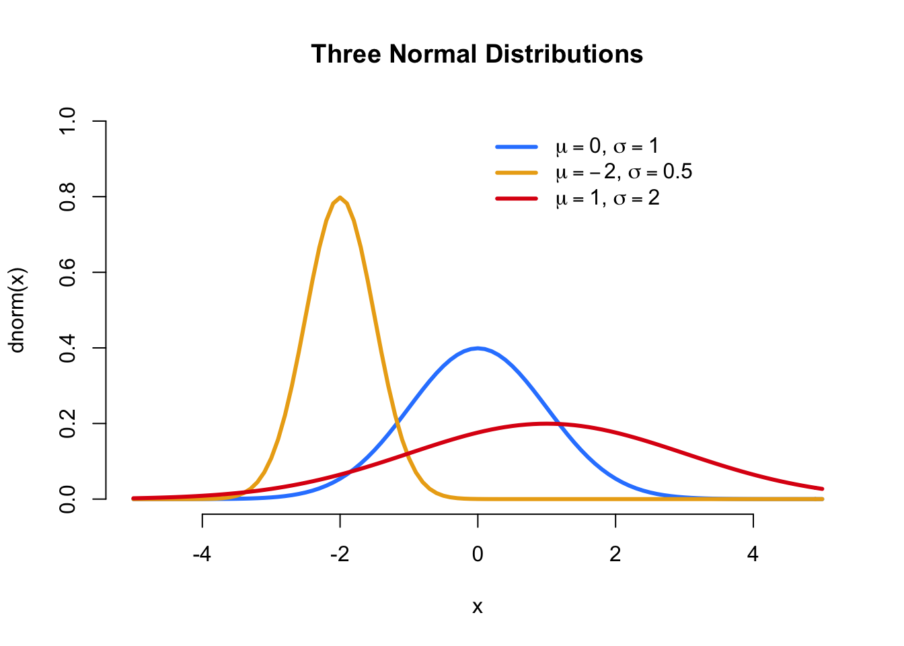

```{r setup, include=FALSE, purl=FALSE}
options(htmltools.dir.version = FALSE)
knitr::opts_chunk$set(comment = "##")
library(datasets)
library(ggplot2)
library(dplyr)
```

```{r xaringan-logo, echo=FALSE}
xaringanExtra::use_logo(image_url = "Rlogo.png",   width = "90px",height = "85px")
```

```{r xaringan-themer, include=FALSE}
library(xaringanthemer)
style_duo_accent(
  primary_color = "#035AA6", 
  secondary_color = "#0556AA",
  #text_font_google = google_font("Roboto"),
  text_font_size = "23px",
  background_color = "#FFFFFF",
  #code_font_family = "Ligature Code",
  code_font_size = "0.9em", 
  footnote_color = "blue",
  footnote_position_bottom = "0.1em",  
  )
```


# <span style="color:blue"> Outlines</span>

- **Random sampling**

- Built in **discrete probability distributions**
   - *Binomial* Distribution
   - *Geometric* Distribution
   - *Negative Binomial* Distribution
   - *Poisson* Distribution

- Built in **continuous probability distributions**
   - *Uniform* distribution
   - *Exponential* distribution
   - *Normal* distribution

- **Examining the distribution of a set of data**
- **Simulating** the Sample Distribution of the Mean


---

### Random sampling

- Because R is a language built for statistics, it contains many functions that allow you generate random data  
   – either from a vector of data, or from an established probability distribution.

- The standard `sample()` function used for drawing random values from a vector. 

**Argument	definition `sample()` function**
- `x`:	A vector of outcomes you want to sample from. 
- `size`:	The number of samples you want to draw. *The default is the length of x*.
- `replace`:	Should sampling be done with replacement?
- `prob`:	A vector of probabilities of the same length as x indicating how likely each outcome in x is. 
   + *The default is equally likely*.
- The `sample()` function allows you to draw random samples of elements (scalars) from a vector. 

---

Let’s use sample() to draw 10 samples from a vector of integers from 1 to 10.

.pull-left[
```{r}
# Draw with out replacement #<<
sample(x = 1:10, size  = 5)
```
]
.pull-right[
```{r}
# Draw with replacement #<<
sample(x= 1:5, size = 10,replace=TRUE)
```
]

- If you try to draw a large sample from a vector replacement, R will return an error because it runs out of things to draw:

- To specify how likely each element in the vector x should be selected, use the prob argument. 
- The length of the prob argument should be as long as the x argument.

```{r}
#Draw 10 samples with probability of selecting “a” to be .90
sample(x = c("a", "b"), prob = c(.8, .2),
       size = 10, replace = TRUE)
```

---

###	Built in discrete probability distributions

- What is a probability distribution? 

- How to generate random data from specified probability distributions. 
.pull-left[
  **Discrete Distribution**

Distribution | R name | Parameters
------------ | ------ | ----------
Binomial     | binom  | size, prob
Negative binomial | nbinom | size, prob
Poisson      | pois   | lambda
geometric    | geom   | prob
]
.pull-right[
  **Continuous Distribution**

Distribution | R name | Parameters
------------ | ------ | ----------
chi-squared  | chisq  | df, ncp
exponential  | exp    | rate
F            | f      | df1, df2, ncp
uniform      | unif   | min, max 
normal       | norm   | mean, sd
Student's t  | t      | df, ncp

]

---

### General Syntax for Distribution Functions

- There are four basic R commands that apply to the various distributions defined in R. 

- Functions are provided to evaluate the pdf (d), CDF (p), quintile (q) and simulate from the distribution (r). 

- Each letter can be added as a prefix to any of the R distribution names. 

- Letting dist denote the particular distribution then the basic syntax of the four basic commands are:

```{r, eval=FALSE}
ddist (x, parameters)  # probability density of DIST evaluated at x.
qdist (p, parameters)  # returns x for Pr(DIST(parameters)>= x) = p
pdist(x, parameters)  # returns Pr(DIST(parameters) <= x)
rdist(n, parameters)  # generates n random variables from DIST (parameters) 
```

---

### R Functions for Probability Distributions

- Every distribution that R handles has four functions. 
- There is a root name, for example, the root name for the normal distribution is norm. 
- This root is prefixed by one of the letters

- `p`:  for **probability**, the cumulative distribution function (c.d.f.)
- `q`:  for **quantile**, the inverse c.d.f.
- `d`:  for **density**, the density function (p.f. or p.d.f.)
- `r`:  for **random**, a random variable having the specified distribution

- For the binomial distribution, these functions are `pbinom`, `qbinom`, `dbinom`, and `rbinom`. 

- For a discrete distribution, the **d** function calculates the density (p.f.), which in this case is a probability $$f(x) = P(X = x)$$
and hence is useful in calculating probabilities.

---

## The Binomial Distribtion


- Density, distribution function, quantile function and random generation for the binomial distribution with parameters size and prob.

```r
dbinom(x, size, prob, log = FALSE)
pbinom(q, size, prob, lower.tail = TRUE, log.p = FALSE)
qbinom(p, size, prob, lower.tail = TRUE, log.p = FALSE)
rbinom(n, size, prob)
```

- **Arguments**

  - `x, q` :	vector of quantiles.
  - `p` :	vector of probabilities.
  - `n` :	number of observations. 
  - `size` : number of trials (zero or more).
  - `prob` : probability of success on each trial.
  - `log, log.p` : logical; if TRUE, probabilities p are given as log(p).
  - `lower.tail` : logical; if TRUE (default), probabilities are $P[X \le x]$, otherwise, $P[X > x]$.

---

**Details**
- The binomial distribution with `size = n` and `prob = p` has density

$p(x) = {n \choose x} {p}^{x} {(1-p)}^{n-x}$, for $x = 0, \ldots, n$. 

- `dbinom` is the R function that calculates the p.f. of the binomial distribution. 

- Both of the R commands in the box below do exactly the same thing.

```{r}
dbinom(27, size=100, prob=0.25)
dbinom(27, 100, 0.25)
```

- They look up P(X = 27) when X is has the Bin(100, 0.25) distribution.

**Question:** What is P(X = 1) when X has the Bin(25, 0.005) distribution?

---

- `pbinom` is the R function that calculates the c.d.f. of the binomial distribution. 

```{r}
pbinom(27, size=100, prob=0.25)
pbinom(27, 100, 0.25)
```

- They look up P(X `<=` 27) when X is has the Bin(100, 0.25) distribution. 

**Question**: What is P(X <= 1) when X has the Bin(25, 0.005) distribution?

- `qbinom` is the R function that calculates the **inverse c.d.f.** of the binomial distribution. 

- The quantile is defined as the smallest value x such that `F(x) >= p`, where F is the distribution function.

Example
Question: What are the 10th, 20th, and so forth quantiles of the `Bin(10, 1/3)` distribution?

---

Answer:

```{r}
qbinom(0.1, 10, 1/3)
qbinom(0.2, 10, 1/3)
# and so forth, or all at once with
qbinom(seq(0.1, 0.9, 0.1), 10, 1/3)
```

---

### The Geometric Distribution

- Density, distribution function, quantile function and random generation for the geometric distribution with parameter prob.
```r
dgeom(x, prob, log = FALSE)
pgeom(q, prob, lower.tail = TRUE, log.p = FALSE)
qgeom(p, prob, lower.tail = TRUE, log.p = FALSE)
rgeom(n, prob)
```

**Arguments**

- `x, q`	: vector of quantiles representing the number of failures in a sequence of Bernoulli trials before success occurs.
- `p` : vector of probabilities.
- `n` : number of observations. 
- `prob` : probability of success in each trial. 0 < prob <= 1.
- `log, log.p`:*logical*; if **TRUE**, probabilities p are given as log(p).
- `lower.tail` : *logical*; if **TRUE** (default), probabilities are $P[X \le x]$, otherwise, $P[X > x]$.

---

- The geometric distribution with `prob = p` has density

$p(x) = p {(1-p)}^{x}$, for $x = 0, 1, 2, \ldots, 0 < p \le 1$.

- If an element of x is not integer, the result of dgeom is zero, with a warning.

- The quantile is defined as the smallest value xx such that $F(x) \ge p$, where FF is the distribution function.


---
### Negative Binomial Distribution

- Density, distribution function, quantile function and random generation for the negative binomial distribution with parameters size and prob.

```r
dnbinom(x, size, prob, mu, log = FALSE)
pnbinom(q, size, prob, mu, lower.tail = TRUE, log.p = FALSE)
qnbinom(p, size, prob, mu, lower.tail = TRUE, log.p = FALSE)
rnbinom(n, size, prob, mu)
```

- `x`	: vector of (non-negative integer) quantiles.
- `q`	: vector of quantiles.
- `p`	: vector of probabilities.
- `n`	: number of observations. 
- `size` : target for number of successful trials.
- `prob`: probability of success in each trial. 0 < prob <= 1.
- `mu`: alternative parametrization via mean: see ‘Details’.
- `log, log.p`: *logical*; if **TRUE**, probabilities p are given as log(p).
- `lower.tail`: logical; if TRUE (default), probabilities are $P[X \le x]$, otherwise, $P[X > x]$.

---

- The negative binomial distribution with `size = n` and `prob = p` has density

$$p(x) = \frac{\Gamma(x+n)}{\Gamma(n) x!} p^n (1-p)^x,$$

for $x = 0, 1, 2, \ldots, n > 0$ and $0 < p \le 1$.

- This represents the number of failures which occur in a sequence of Bernoulli trials before a target number of successes is reached. 
- The mean is $\mu = n(1-p)/p$ and variance $n(1-p)/p^2$.

---

### Poisson Distribution

- Density, distribution function, quantile function and random generation for the Poisson distribution with parameter lambda.

```r
dpois(x, lambda, log = FALSE)
ppois(q, lambda, lower.tail = TRUE, log.p = FALSE)
qpois(p, lambda, lower.tail = TRUE, log.p = FALSE)
rpois(n, lambda)
```
**Arguments**
- x	: vector of (non-negative integer) quantiles.
- q	: vector of quantiles.
- p	: vector of probabilities.
- n	: number of random values to return.
- lambda : vector of (non-negative) means.
- log, log.p: *logical*; if **TRUE**, probabilities p are given as log(p).
- lower.tail: *logical*; if **TRUE** (default), probabilities are $P[X \le x]$, otherwise, $P[X > x]$.

---

The Poisson distribution has density

$$p(x) = \frac{\lambda^x e^{-\lambda}}{x!},$$for $x = 0, 1, 2, \ldots,.$
- The mean and variance are $E(X) = Var(X) = \lambda$.


- `dpois` gives the (log) density, 
- `ppois` gives the (log) distribution function,
- `qpois` gives the quantile function, and 
- `rpois` generates random deviates.
---

## Built in continuous probability distributions

### Uniform distribution

Next, let’s move on to the Uniform distribution. 

```{r, out.width = "400px", echo=FALSE, fig.align='center'}

```

- The Uniform distribution gives equal probability to all values between its minimum and maximum values. 
- In other words, everything between its lower and upper bounds are equally likely to occur. 

---

- To generate samples from a uniform distribution, use the function `runif()`, the function has 3 arguments:

**Argument	Definition from `runif()`**

- `n`:	The number of observations to draw from the distribution.
- `min`:	The lower bound of the Uniform distribution from which samples are drawn
- `max`:	The upper bound of the Uniform distribution from which samples are drawn

```{r}
# 5 samples from Uniform dist with bounds at 0 and 1
runif(n = 5, min = 0, max = 1)
```

```{r}
# 10 samples from Uniform dist with bounds at -100 and +100
runif(n = 10, min = -100, max = 100)
```

---

### Exponential distribution


```{r, eval=FALSE}
dexp(x, rate = 1, log = FALSE)
pexp(q, rate = 1, lower.tail = TRUE, log.p = FALSE)
qexp(p, rate = 1, lower.tail = TRUE, log.p = FALSE)
rexp(n, rate = 1) 

```

---
### Normal distribution

1. Normal distribution

```{r, eval=FALSE}
dnorm(x, mean = 0, sd = 1, log = FALSE)
pnorm(q, mean = 0, sd = 1, lower.tail = TRUE, log.p =FALSE) 
qnorm(p, mean = 0, sd = 1, lower.tail = TRUE, log.p = FALSE)
rnorm(n, mean = 0, sd = 1)
```

```{r, out.width = "400px", echo=FALSE, fig.align='center'}

```

- Three different normal distributions with different means and standard deviations

---

**Argument	Definition**

- `n`:	The number of observations to draw from the distribution.
- `mean`:	The mean of the distribution.
- `sd`:	The standard deviation of the distribution.
- The Normal distribution is bell-shaped, and has two parameters: a mean and a standard deviation. 

- To generate samples from a normal distribution in R, we use the function `rnorm()`

```{r}
# 5 samples from a Normal dist with mean = 0, sd = 1
rnorm(n = 5, mean = 0, sd = 1)
```

```{r}
# 3 samples from a Normal dist with mean = -10, sd = 15
rnorm(n = 3, mean = -10, sd = 15)
```

- Again, because the sampling is done randomly, you’ll get different values each time you run `rnorm()`

---

## Random samples will always change

- Every time you draw a sample from a probability distribution, you’ll `(likely)` get a different result. 
- For example, see what happens when I run the following two commands 

### Use set.seed() to control random samples

- There will be cases where you will want to create a reproducible example of some code that anyone else can replicate exactly. 
- To do this, use the `set.seed()` function. 
- Using `set.seed()` will force R to produce consistent random samples at any time on any computer.

– you can set the seed to any integer you want. 

```{r}
#   always produce the same values
set.seed(100)
rnorm(3, mean = 0, sd = 1)
rnorm(3, mean = 0, sd = 1)
```

Density
dnorm is the R function that calculates the p. d. f. f of the normal distribution. As with pnorm and qnorm, optional arguments specify the mean and standard deviation of the distribution.

There's not much need for this function in doing calculations, because you need to do integrals to use any p. d. f., and R doesn't do integrals. In fact, there's not much use for the "d" function for any continuous distribution (discrete distributions are entirely another matter, for them the "d" functions are very useful, see the section about dbinom).

For an example of the use of pnorm, see the following section.

Random Variates
rnorm is the R function that simulates random variates having a specified normal distribution. As with pnorm, qnorm, and dnorm, optional arguments specify the mean and standard deviation of the distribution.

We won't be using the "r" functions (such as rnorm) much. So here we will only give an example without full explanation.


----

This generates 1000 i. i. d. normal random numbers (first line), plots their histogram (second line), and graphs the p. d. f. of the same normal distribution (third and forth lines).

---


- The following examples illustrate the use of the R functions for computations involving statistical distributions:

```{r, eval=FALSE}
rnorm(10) # draws 10 random numbers
rnorm(10, 5, 2) # N(µ= 5,sigma = 2) distribution
dnorm(2) # return pdf at z= 2.
pnorm(0) # returns cdf at t =0
qnorm(0.5) # returns the 50% quantile 
```


```{r, eval=FALSE}
mysample <- rnorm(50) # generates random numbers
mu <- mean(mysample) # computes the sample mean
sigma <- sd(mysample) # computes the sample standard
x <- seq(-4, 4, length = 500) # defines x values for the pdf
options(digits=3)

y <- round(dnorm(x, mu, sigma), digits=4) # computes the normal pdf
y
```

---

# Repeatable Simulations

- For a simulation to be repeatable we need to specify the type of random number generator and the initial state of the generator.

- The simplest way to specify the initial state or seed is to use, `set.seed(seed)`
 
- The argument seed is a single integer value

- Different seeds give different pseudo-random values

- Calling `set.seed()` with the same seed produces the same results, if the sequence of calls is repeated exactly.

- If a seed is not specified then the random number generator is initialized using the time of day.

---

### example

```{r, eval=FALSE}
set.seed(17632)
runif(5)
rnorm(5)
set.seed(89432)
runif(5)#<<
set.seed(17632)
runif(5)#<<
rnorm(5)
set.seed(17632)
rnorm(5)
runif(5)
```

---

### Simulating the Sample Distribution of the Mean

- Simulation is a numerical technique for conducting experiments on the computer. 
- It uses to compare results of an inference under different assumptions

- In any of the cases, it is often needed to create repeated random samples from a specific statistical model, and see how our approach behaves.

- The central limit theorem is perhaps the most important concept in statistics. 

- Samples taken from any distribution with finite mean and standard deviation, will tend towards a normal distribution around the mean of the population as sample size increases. 

- Furthermore, as sample size increases, the variation of the sample means will decrease. 

```{r, eval=FALSE}
data<-rnorm(25 , 100 , 15)
mean(data)
sd(data)
```

---

- We know that, when the population is normal,  $\mu=100, \sigma = 15, and N = 25$, the sample mean has a normal distribution with mean 100 and standard deviation 3. 

- Let's verify that with a statistical simulation.
```{r, eval=FALSE}
mean(rnorm(25 , 100 , 15))
replicate(10,mean(rnorm(25, 100, 15)))  # replicate 10 times
data<-replicate(100000,mean(rnorm(25,100, 15))) #replicate 100000 times 
mean(data )
sd(data )
```

- Those results are very close to our theoretical expectation.

- Let's look at histogram of our means.

```{r, eval=FALSE}
hist(data, breaks=100) #Or
plot (density(data))   #Density plot of data
```

- It certainly looks normal
- We can easily induce R to superimpose the precise probability density function on top of this graph. I'm making my line dotted red.
```{r, eval=FALSE}
curve(dnorm(x , 100, 3), 88, 112, col = 'red', lty =2, add = TRUE )
```
 